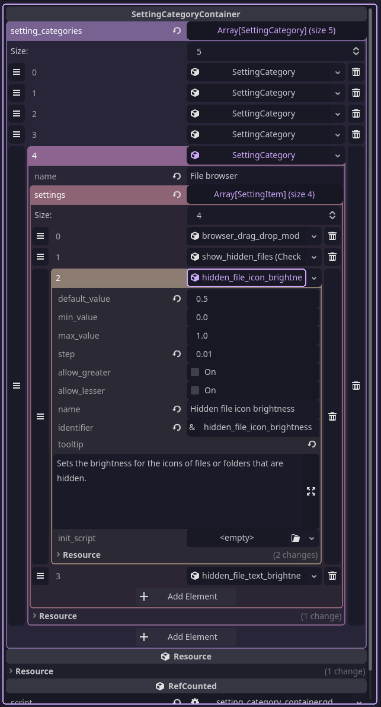

```yaml
title: How to make a settings system in GDScript
description: >
    Making a flexible settings system in GDScript
tags: [godot, gdscript, sunfish, cursed]
published-date: "2025-11-10T20:12:00Z"
# comment-did: "at://did:plc:lkrhpzgaij74fjzqeimfyicc/app.bsky.feed.post/3m25udn7ey22f"
hide: true
```

For the past month or so I've been working on [sunfish](https://github.com/sockeye-d/sunfish), an infinite canvas whiteboard app made in Godot. I wanted it to have configurable settings, and I've had to deal with that in the past but I hadn't found a satisfactory way to do it until now.

## Pre-sunfish

My other made-in-Godot application [sled](https://github.com/sockeye-d/sled) also had a configuration system. It felt quite limiting and clunky to use because it was based on nested Resources. I had a top-level array that held arrays of configuration categories, then each of those had a list of configuration items, of which I had 14 different types for each type of setting (string, slider, file path, etc.). Custom items like the font settings need to be populated by script, so I came up with "init scripts": a script with a static method that you attach to the resource that gets run when the resource gets instantiated. As you could imagine, finding anything was like finding a needle in a haystack:



I've got a hiDPI monitor but this was still pretty annoying to edit. Finding the keys to anything was such a pain, it wasn't easy to search through due to not being text, and I just regretted making it every time I had to change something. I made this system a couple years ago, and in that time, I've learned a few tricks.

## The basics

For sunfish, I knew I did not want to do *that* again. My requirements were that it must be

* easy to edit
* easy to search
* use rDNS-namespaced identifiers, for plugins
* have better VCS integration

Another thing that had to go was the init scripts. They were really annoying.

All of these pointed to one thing: GDScript

## Scripts as a data container specification

In Godot, all scripts are resources.
This may seem like a trivial implementation detail at first, but it has some interesting implications. For example, a script's `#!gdscript _static_init()` initializer is run when the Script resource is loaded:

```gdscript
static func _static_init() -> void:
    print("I just got loaded by someone else! Yay!")
```

> This is actually a completely valid GDScript script by itself! You don't need an `extends`, nor do you need a `class_name`. In fact, you can have a completely empty script, but it won't do anything, and it'll generate a warning.

Godot's scripts also have excellent introspection capabilities. This is most necessary for the Godot editor itself, because of things like the property inspector, but it's not editor-specific. Any Godot object can be queried for a list of its properties, and property values can be get and set by name.

The final piece of this is that annotations like `#!gdscript @export` is that all they do is add a property hint and some flags to the property's metadata. All of this information can be queried at runtime.

In my new scheme, if were to do something like

```gdscript
@export var hi: int
```

this *almost* accomplishes what my previous system did with 14 different custom resource types. To actually accomplish the whole thing, I add one new thing: a base class called `#!gdscript Configuration` containing identification methods:

```gdscript
@abstract class_name Configuration

@abstract func get_id() -> StringName
```

> This is using the new 4.5 feature of abstract classes. It works the same without the annotations, they just make it a little safer.

The `#!gdscript get_id() -> StringName` function is for the reverse-DNS namespaced identifiers. Each configuration object is given a constant, unique ID which can then be used to lookup its properties.


Let's revisit the list:

- ~~easy to edit~~ <span style="color:var(--green)">Text editors are much easier and faster</span>
- ~~easy to search~~ <span style="color:var(--green)">Text can be grepped etc.</span>
- ~~use rDNS-namespaced identifiers, for plugins~~ <span style="color:var(--green)">`#!gdscript get_id()` solves this</span>
- ~~have better VCS integration~~ <span style="color:var(--green)">A plaintext script is much more VCS-friendly than a text resource</span>

## How this works

As I mentioned before, Godot allows you to introspect an object's properties with [`get_property_list`](https://docs.godotengine.org/en/stable/classes/class_object.html#class-object-method-get-property-list). This returns a Dictionary like this:

```gdscript
[
    { "name": "RefCounted", "class_name": &"", "type": 0, "hint": 0, "hint_string": "RefCounted", "usage": 128 },
    { "name": "script", "class_name": &"Script", "type": 24, "hint": 17, "hint_string": "Script", "usage": 1048582 },
    { "name": "core.gd", "class_name": &"", "type": 0, "hint": 0, "hint_string": "res://scripts/config/core.gd", "usage": 128 },
    { "name": "theme", "class_name": &"", "type": 4, "hint": 256, "hint_string": "dev.fishies.sunfish.themes.Black,dev.fishies.sunfish.themes.CatppuccinLatte,dev.fishies.sunfish.themes.CatppuccinMocha", "usage": 4102 },
    { "name": "default_tool", "class_name": &"", "type": 4, "hint": 256, "hint_string": "dev.fishies.sunfish.BrushTool,dev.fishies.sunfish.EraserTool,dev.fishies.sunfish.LineTool,dev.fishies.sunfish.CircleTool,dev.fishies.sunfish.FilledCircleTool,dev.fishies.sunfish.RectangleTool,dev.fishies.sunfish.FilledRectangleTool,dev.fishies.sunfish.ImageTool,dev.fishies.sunfish.TextTool,dev.fishies.sunfish.BookmarkTool,dev.fishies.sunfish.ScreenshotTool", "usage": 4102 },
    { "name": "show_debug_menu", "class_name": &"", "type": 1, "hint": 0, "hint_string": "", "usage": 4102 }, { "name": "toast_display_time", "class_name": &"", "type": 3, "hint": 1, "hint_string": "0.1,10.0,0.01,or_greater", "usage": 4102 },
    { "name": "configuration.gd", "class_name": &"", "type": 0, "hint": 0, "hint_string": "res://scripts/resources/configuration.gd", "usage": 128 }
]
```

Here's what each of the keys and values means:

|key|value|
|-|-|
|`name`|The name of the property.|
|`type`|One of the [`#!gdscript Variant.Type`](https://docs.godotengine.org/en/latest/classes/class_%40globalscope.html#enum-globalscope-variant-type) enumerations.|
|`class_name`|If `#!gdscript type == TYPE_OBJECT`, it specifies the class name of that object's type.|
|`hint`|One of the [`#!gdscript PropertyHint`](https://docs.godotengine.org/en/latest/classes/class_%40globalscope.html#enum-globalscope-propertyhint) enumerations specifying how this property should be displayed in the inspector. For example, annotating the property with `#!gdscript @export_range` sets this to `#!gdscript PROPERTY_HINT_RANGE`.|
|`hint_string`|This is specific to the specific `hint` the property has. For example, `#!gdscript @export_enum("Fish", "Potato", "Godot", "Robot")` will make this be `#!gdscript "Fish,Potato,Godot,Robot"`, which the inspector then parses to set items of the MenuButton.|
|`usage`|A bitwise combination of [`#!gdscript PropertyUsageFlags`](https://docs.godotengine.org/en/latest/classes/class_%40globalscope.html#enum-globalscope-propertyusageflags). These are just extra metadata. For example, `#!gdscript @export` adds `#!gdscript PROPERTY_USAGE_STORAGE + PROPERTY_USAGE_EDITOR` while `#!gdscript @export_storage` only adds `#!gdscript PROPERTY_USAGE_STORAGE`. Unlike property hints, there can only be up to 32 (possible 31), and Godot defines 29, so you can't really extend these with your own (I did anyway).|

Now that we have a way to get a list of properties of an object and a way to get the ID of that specific object, we still need a way to generate a set of UI widgets.

### The inspector

